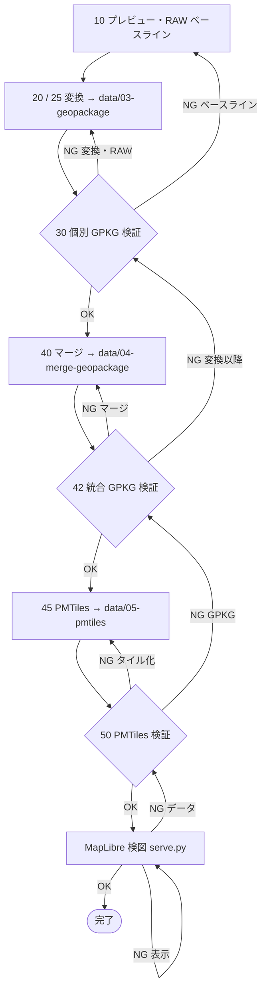

# プロジェクト移行・構造整理プラン（zure-map-pipeline）

## 目次

1. [目的とリモート](#sec-1)
2. [制約とポリシー](#sec-2)
3. [データ品質ゴールと RAW](#sec-3)
4. [パイプライン（検証・フロー・段階）](#sec-4)
5. [リポジトリ構成](#sec-5)
6. [命名と注意点](#sec-6)
7. [引越し手順（Git・WSL）](#sec-7)
8. [チェックリストと進捗ログ](#sec-8)
9. [参照と未決定事項](#sec-9)

---

<a id="sec-1"></a>

## 1. 目的とリモート

- 作業の本拠を **`zure-map-pipeline`** に移す。リモート: **[Yoshida088603/zure-map-pipeline](https://github.com/Yoshida088603/zure-map-pipeline)**（`git@github.com:Yoshida088603/zure-map-pipeline.git`）。
- **`zure-map-pipeline` 単体でパイプラインが回ることを確認したうえで**、**ユーザーが手動で** `/home/ubuntu/work/cursor/maplibre/MapLibre-HandsOn-Beginner` **を丸ごと削除**する（コピー漏れ確認後。親 `maplibre` に他物があればユーザーが整理）。**AI・ツールが HandsOn を自動削除してはならない**（[§2.3](#sec-2-3)）。

---

<a id="sec-2"></a>

## 2. 制約とポリシー

<a id="sec-2-1"></a>

### 2.1 スコープ外（確定）

- **PostgreSQL 経由のパイプラインは使わない**（例: `run_pipeline_pg.sh`、`pg_start.sh` / `pg_stop.sh`、`restore_pg_dump.sh`、PostGIS 上の変換・ビュー）。関連スクリプト・SQL は **`zure-map-pipeline` に引っ越ししない**。
- 正規経路は **ファイルベース**。主幹: **プレビュー → 変換 → 検証 → マージ → 検証 → PMTiles → 検証 → MapLibre**（**検証 OK のときだけ次へ**。NG は [§4.1](#sec-4-1)）。

### 2.2 実行環境（確定）

- **WSL2 上の Linux** を主とする。番号付きスクリプトは **`.sh`（bash）**（`.ps1` は使わない）。
- GDAL 隔離・`source env.sh` 相当は、相談のうえ `02-convert` で決める。
- **GDAL はマシン依存**。`ogr2ogr` / `ogrinfo` が **PATH に無い**環境では番号付きスクリプトは動かない。**Cursor のエージェント用 Linux** と **ユーザーの WSL** は同一ではない（詳細は [§8.3](#sec-8-3)）。

<a id="sec-2-3"></a>

### 2.3 AI・エージェント向け（必須）

- **`.sh` はオーナーがスタブを先に置いてから**実装・デバッグ。**明示の指示がない限り `.sh` を新規作成しない**。`.sh` にないスクリプト実行も原則しない。
- **`/home/ubuntu/work/cursor/maplibre/MapLibre-HandsOn-Beginner`（配下含む）の削除・移動・`rm -rf` は行わない**。削除は**ユーザーのみ**。計画に「削除」とあってもエージェントが実行してはならない。

---

<a id="sec-3"></a>

## 3. データ品質ゴールと RAW

### 3.1 ゴール（データ品質）

- **RAW**（`data/01-raw-data`＝DVD を**構成そのまま**複製したもの）と **PMTiles**（`data/05-pmtiles`）の整合を、可能な範囲で**再現可能に検証**する。「完全整合」は下表の**計測可能な条件**で定義する。

<a id="sec-3-2"></a>

### 3.2 「RAW ↔ PMTiles 整合」の定義

ベクタタイルは一般化等により**生データとバイト一致はしない**のが普通。本計画では次の**階層**で揃え、**10 → 30 → 42 → 50 → MapLibre** で照合する。

| 階層 | 意味 | 主な手段 |
|------|------|----------|
| **A** トレーサビリティ | どの RAW バッチ・ジョブがどの PMTiles か | 入力一覧のハッシュ／件数ログ、**ビルド ID・日時**を `docs/` 等に残す |
| **B** 件数・範囲 | RAW と GPKG 各段・PMTiles メタの**論理的一貫性** | **10** でベースライン、**30/42** で突合、**50** で PMTiles 読み取り |
| **C** 座標・CRS | Y/X 列・EPSG・bbox | **30/42**、MapLibre で位置合わせ |
| **D** 属性 | 代表属性・主キー相当のサンプル | **30**、必要なら RAW 行 ID と GPKG の対応表 |
| **E** タイル化差分の明示 | 45 の一般化・drop・ズームで件数・形状が変わり得る | README／`docs/` に**意図した差分**を記載。説明なきずれは不具合候補 |
| **F** 可視化 | 人間による検図 | MapLibre + `06-analysis-result` |

**運用で埋める項目**: （10 のベースライン必須項目を README で固定）／（50 で GPKG との件数・メタ照合の具体）／（マージ集約で RAW と 1:1 にならない場合は「マージ後 GPKG ↔ PMTiles」を主とする）／（再実行時は同じベースライン手順で再計測）。

### 3.3 移行元（HandsOn）と RAW の所在

| 項目 | パス |
|------|------|
| 本拠（コピー元のリポジトリ断片） | `/home/ubuntu/work/cursor/maplibre/MapLibre-HandsOn-Beginner` |
| MapLibre ＋ PMTiles 表示 | `05_ポリゴン表示/` |
| GDAL・変換スクリプト | `05_ポリゴン表示/gdal-full/` |

**RAW（確定）** — 「そのまま」＝**構成を変えず** `data/01-raw-data` へ複製（`rsync -a` / `cp -a`）。

| 役割 | パス |
|------|------|
| **コピー元**（移行中のみ） | `…/gdal-full/inputfile/20260219昨年納品DVD/` |
| WSL 例 | `/home/ubuntu/work/cursor/maplibre/MapLibre-HandsOn-Beginner/05_ポリゴン表示/gdal-full/inputfile/20260219昨年納品DVD/` |
| **コピー先**（以後の RAW 正） | `zure-map-pipeline/data/01-raw-data/`（DVD ルート直下の内容） |

- **10** は**コピー後の** `data/01-raw-data` を対象とする。
- **`data/01-raw-data` は原則 `.gitignore`**（容量）。README にコピー手順を書いてよい。
- ユーザーが HandsOn を**手動削除する前に**、スクリプト・`docs`・設定など**必要物をすべて** `zure-map-pipeline` へコピーし、**漏れをユーザーが確認**する（エージェントは削除しない）。

**HandsOn README の要約（現行パイプラインのイメージ）**

- 土地活用・街区など: **CSV**（Y/X 列解釈）→ **GPKG** → **マージ GPKG** → **PMTiles**。
- 地図: **`serve.py` 必須**（Range／Content-Length）。`python3 -m http.server` では PMTiles 不可。
- 中間形式は **GeoPackage（.gpkg）**（geoparquet という誤称は使わない）。

---

<a id="sec-4"></a>

## 4. パイプライン（検証・フロー・段階）

<a id="sec-4-1"></a>

### 4.1 検証とフィードバックループ（確定）

- **ゲート方式**: **10 → 30 → 42 → 50 → MapLibre 検図**の各後で、**整合が取れるまで次工程に進まない**。
- **NG 時**: `docs/` に原因を記録し、**当該段より前に戻ってやり直す**。悪い GPKG／PMTiles を次へ渡さない。

| 検証 NG | 主な戻り先 |
|---------|------------|
| **30** | **25 / 20**。必要なら **10** |
| **42** | **40**。必要なら **30** または **25/20** |
| **50** | **45**。必要なら **42** |
| **MapLibre** | データなら **50** 以前。表示のみならスタイル／パス修正（**45 以降は再実行しない**ことも） |

### 4.2 基幹処理フロー（Mermaid）

戻りの詳細は上表。図は省略あり。



### 4.3 検証の担当（スクリプト番号）

| 番号 | スクリプト（案） | 対象 | 内容の例 |
|------|------------------|------|----------|
| **10** | `10-data-preview.sh` | `data/01-raw-data` | ベースライン（件数・CRS・主キー・bbox 等） |
| **30** | `30-check-geopackage.sh` | 個別 GPKG | 10 との突合、CRS、閉じていないポリゴン、属性検証 |
| **42** | `42-check-merge-geopackage.sh` | 統合 GPKG | 件数・レイヤ・投影・bbox（定義 E の文書化含む） |
| **50** | `50-check-pmtiles.sh` | PMTiles | メタ・Range・書き込み、GPKG との論理照合、定義 E との整合 |

- **45** `45-geopackage2pmtiles.sh`: タイル化**オプション**を README／`docs/` に残し、50 で判定可能にする。
- **スモーク**（1 件 E2E）は主幹外。**任意**で `02-convert/scripts-smoke/` 等に `single_csv_to_pmtiles.sh` 相当を記載。

### 4.4 段階一覧と補足

| 順 | 段階 | 置き場 | 役割 |
|----|------|--------|------|
| 1 | プレビュー | `01-raw-data-preview` / `data/02-raw-data-preview` | プレビュー・明細作成 |
| 2 | 変換 | 20/25 → `data/03-geopackage` | 個別 GPKG |
| 3 | 検証 | **30** | 個別 GPKG |
| 4 | マージ | **40** → `data/04-merge-geopackage` | 統合 GPKG |
| 5 | 検証 | **42** | 統合 GPKG |
| 6 | PMTiles | **45** → `data/05-pmtiles` | 定義 E を文書化 |
| 7 | 検証 | **50** | 定義 A〜E |
| 8 | MapLibre | `03-analysis/maplibre` + `serve.py` | 定義 F、`06-analysis-result` |

**HandsOn 側との差分で決めること**

1. **CSV** はデータセットごとに列・Y/X が異なる → `25` を分岐または分割するか。
2. **マージ**は `merge_tochi_*` / `merge_gaiku_*` 等と用途別 → `40` の呼び出し設計。
3. **PostgreSQL パイプライン** — スコープ外（[§2.1](#sec-2-1)）。
4. **`06-analysis-result`（暫定）** — スクショ・短い `.md`、任意 GeoJSON。**PMTiles の複製は置かない**。
5. **GPKG→PMTiles** — 環境により一時 Parquet 経路あり得る。**保管の正**は GPKG と PMTiles（一時ファイルは変換内部）。

---

<a id="sec-5"></a>

## 5. リポジトリ構成

```text
Cursor/zure-map-pipeline/
├── README.md
├── .cursor/
├── docs/
├── 01-raw-data-preview/
│   └── 10-data-preview.sh
├── 02-convert/
│   ├── 20-shp2geopackage.sh
│   ├── 25-csv2geopackage.sh
│   ├── 30-check-geopackage.sh
│   ├── 40-merge-geopackage.sh
│   ├── 42-check-merge-geopackage.sh
│   ├── 45-geopackage2pmtiles.sh
│   └── 50-check-pmtiles.sh
├── 03-analysis/
│   └── maplibre/
│       ├── styles/
│       ├── index.html
│       ├── main.js
│       ├── serve.py
│       └── style.css
└── data/
    ├── 01-raw-data/          # DVD 複製（原則 .gitignore）
    ├── 02-raw-data-preview/
    ├── 03-geopackage/        # shp2geopackage / csv2geopackage 配下にデータセット別
    ├── 04-merge-geopackage/
    ├── 05-pmtiles/
    ├── 06-analysis-result/
    └── 07-rasters/           # 原則 .gitignore
```

`data/03-geopackage` と `04-merge-geopackage` の下位は、用途どおり **`shp2geopackage` / `csv2geopackage`** と **`14jo-chizu`・`zure-map`・`gaiku`・`toshibu`・`tochikatsu`** などデータセット別フォルダを置く（ツリーは長くならないようここでは省略）。

**パイプライン外の置き場（一行）**: レポート **`docs/`**、スタイル JSON **`03-analysis/maplibre/styles/`**、ラスタ **`data/07-rasters/`**。

---

<a id="sec-6"></a>

## 6. 命名と注意点

- **GeoPackage** に統一（`geoparquet` 誤用禁止）。スクリプト・フォルダ名も `geopackage` / `gpkg` で揃える。
- **綴り**: `04-merge-geopackage`（`marge` 禁止）、`03-analysis` / `06-analysis-result`（`analys` 禁止）。
- **番号**: 10 → 30 → 40 → 42 → 45 → 50（主幹順）。
- **MapLibre**: `serve.py` と `main.js` の URL／相対パスは**配置確定後**に決める。
- **Git**: `data/` の巨大物は **`.gitignore`**（LFS 方針はリポジトリで明示）。

---

<a id="sec-7"></a>

## 7. 引越し手順（Git・WSL）

### 7.1 リモート

| 方式 | URL |
|------|-----|
| HTTPS | [https://github.com/Yoshida088603/zure-map-pipeline.git](https://github.com/Yoshida088603/zure-map-pipeline.git) |
| SSH | `git@github.com:Yoshida088603/zure-map-pipeline.git` |

### 7.2 パス（想定）

| 役割 | パス |
|------|------|
| 親 | `/home/ubuntu/work/cursor/` |
| 新リポジトリルート | `/home/ubuntu/work/cursor/zure-map-pipeline` |
| 旧・コピー元 | `/home/ubuntu/work/cursor/maplibre/`（HandsOn 等） |

### 7.3 手順（clone から push まで）

1. `cd /home/ubuntu/work/cursor`
2. `git clone git@github.com:Yoshida088603/zure-map-pipeline.git && cd zure-map-pipeline`
3. **`.gitignore`** を先に置く（`data/` の RAW・成果物・巨大ファイル）。
4. [§5](#sec-5) の**骨格**を作成（空ディレクトリは `.gitkeep`）。
5. **コピー**: RAW（DVD 全文）→ `data/01-raw-data/`。MapLibre 一式 → `03-analysis/maplibre/`。変換系 → `02-convert/`（**PostgreSQL 系除外**）。**`.sh` はオーナースタブから**。
6. **コミットする例**: `README.md`、`.cursor/`、`docs/`、アプリ・スタブ `.sh`（秘密情報なし）。
7. **コミットしない**: `data/01-raw-data` 全体、`data/02` 以降の生成物・巨大物、PostgreSQL 関連。
8. `git add -A` → `git status` で巨大ファイルなしを確認 → `commit` → `branch -M main` → `push -u origin main`
9. Cursor で **`zure-map-pipeline` を開く**。HandsOn は**ユーザーが手動削除するまで**参照可。日常は新リポのみ推奨。

**削除前チェックリスト（ユーザー手動）**: `plan`・`README`・独自メモが `zure-map-pipeline`／`docs` に揃っているか → 問題なければユーザーが HandsOn を削除（エージェントは不可）。

---

<a id="sec-8"></a>

## 8. チェックリストと進捗ログ

<a id="sec-8-log"></a>

### 8.1 進捗ログ（日付付き）

| 日付 | 内容 |
|------|------|
| **2025-03-21** | `zure-map-pipeline` を HTTPS で clone（SSH は当環境でホスト鍵検証に失敗したため）。 |
| **2025-03-21** | `.gitignore` 整備、[§5](#sec-5) のディレクトリ骨格（`.gitkeep`）、`README.md` 作成。`.sh` は未作成（オーナースタブ方針）。 |
| **2025-03-21** | 初回コミット `700ceb1`（`chore: リポジトリ骨格と .gitignore（plan §5）`）。 |
| **2025-03-21** | Cursor エージェント環境では `git push` 不可（HTTPS 認証）。**WSL** で `origin` を SSH に変更し `git push -u origin main` 実施（`Everything up-to-date` でリモートと整合）。 |
| **2025-03-21** | RAW: HandsOn の `…/inputfile/20260219昨年納品DVD/` を `rsync -a` で `data/01-raw-data/` に複製（約 6.8G、元フォルダは削除していない）。 |
| **2025-03-21** | `data/02-raw-data-preview/` に `ファイル数サイズ比較.png` が存在（プレビュー・比較用と推定）。 |
| **2025-03-21** | WSL で `git config --global user.name` と `user.email` を設定済（`git config --global --list` で `user.` を確認）。Cursor の「user.name / user.email を設定して」対策。 |
| **2025-03-21** | **実装移植（HandsOn → `zure-map-pipeline`）**: [§5](#sec-5) に**書かれているファイルだけ**作成・編集。`01-raw-data-preview/10-data-preview.sh`、`02-convert/20`〜`50`、`03-analysis/maplibre`（`index.html`・`main.js`・`serve.py`・`style.css`）、`README.md`。旧 `gdal-full/scripts` 相当を統合（**PostgreSQL 系・GDAL ビルド手順は含めない**）。`25` の CSV 前処理 Python は **`.sh` 内 heredoc**（別名 `.py` は置かない）。`serve.py` はリポジトリルートをドキュメントルートにし、`main.js` の PMTiles 等は **`/data/04-merge-geopackage/`・`/data/05-pmtiles/`** 基準。コミット例: `986c45b`。 |
| **2025-03-21** | **中間形式の方針**: 分析対象が大容量でも、主幹は **GeoPackage のまま**（GeoParquet を正とする分岐は設けない）。Python 分析は GPKG＋既存スタックで対応。 |
| **2025-03-21** | **GDAL 動作確認（環境差）**: Cursor エージェント用 Linux では `ogr2ogr` が PATH に無く（`gdal-bin` 未インストール相当）、`02-convert/50-check-pmtiles.sh` は失敗。**HandsOn** の `gdal-full/local/bin/ogr2ogr` は存在するが、`libgdal.so.*` が見つからない状態では実行不可（`source …/gdal-full/env.sh` や `LD_LIBRARY_PATH` 未設定と同様）。**ビルド不要かどうかの最終判断はユーザーの WSL** で `ogr2ogr --version`・`ogrinfo --formats`（PMTiles 等）・`50-check-pmtiles.sh` を実行して行う（手順は [§8.3](#sec-8-3)）。 |

**いまの位置づけ（要約）**: 骨格・RAW・**番号付きシェル＋MapLibre の移植**・リモート push・Git 作者まで完了。**未了**: **実データでのパイプライン通し検証**（10→…→MapLibre）、**GDAL 隔離（`env.sh` 相当）は任意のまま**、**WSL での GDAL 実機確認**（エージェント環境では未充足）、HandsOn 手動削除（ユーザーのみ）。

---

### 8.2 チェックリスト（項目）

1. ~~[§7](#sec-7) で clone・骨格・初回 push~~ **2025-03-21 済**（WSL・`origin` SSH）。**Git グローバル `user.name` / `user.email`** **2025-03-21 済**。
2. `02-convert`: **`20`〜`50` 実装済（2025-03-21）**。GDAL 隔離（`env.sh` 相当）は**未決・PATH 前提**。**WSL で `ogr2ogr`・`50-check-pmtiles.sh` が通るかはユーザー環境で確認**（エージェント環境では `ogr2ogr` 不在を確認済み、[§8.3](#sec-8-3)）。
3. `03-analysis/maplibre`: **移植済（2025-03-21）**。表示パスは `/data` 基準。**スタイル微調整は任意**。
4. `data/`: RAW は `01-raw-data` にコピー済みを正とする。**2025-03-21 コピー済**。03〜07 とパス定数。PG スクリプトはコピーしない。HandsOn 削除は**ユーザーのみ**。
5. パイプライン: **スクリプト配置済**。**実運転でゲートどおり通す検証は未**（NG は [§4.1](#sec-4-1)、整合は [§3.2](#sec-3-2)）。
6. 完了後: ユーザーが HandsOn を手動削除、作業は `zure-map-pipeline` のみ。エージェントは削除しない。**未達**。

<a id="sec-8-3"></a>

### 8.3 GDAL 動作確認（Cursor エージェント環境と WSL）

**目的**: スクリプトは **`ogr2ogr` / `ogrinfo` が PATH にある前提**（[§2.2](#sec-2-2)）。実際に動くかは **インストール済み GDAL のドライバ**に依存する。

**Cursor エージェント用 Linux では（2025-03-21 時点）**:

| 確認項目 | 結果 |
|----------|------|
| `ogr2ogr` | **PATH に無い**（`apt install gdal-bin` の案内のみ） |
| `02-convert/50-check-pmtiles.sh` | **失敗**（PMTiles ドライバ検証まで到達できない／不可扱い） |
| HandsOn `gdal-full/local/bin/ogr2ogr` | バイナリはあるが **`libgdal.so.34` が見つからない**（共有ライブラリパス未設定）。`source gdal-full/env.sh` 相当が必要 |

**結論**: 上記環境では **「ビルドなしでそのまま動く」ことは確認できない**。エージェントは **WSL 上の結果を置き換えない**。

**ユーザー WSL での確認コマンド（例）**:

```bash
command -v ogr2ogr && ogr2ogr --version
ogrinfo --formats | grep -iE 'PMTiles|Parquet|GPKG'
cd /path/to/zure-map-pipeline
bash 02-convert/50-check-pmtiles.sh
```

HandsOn にビルド済み GDAL がある場合（**ビルドは触らず利用だけ**）:

```bash
source /home/ubuntu/work/cursor/maplibre/MapLibre-HandsOn-Beginner/05_ポリゴン表示/gdal-full/env.sh
ogr2ogr --version
bash /home/ubuntu/work/cursor/zure-map-pipeline/02-convert/50-check-pmtiles.sh
```

---

<a id="sec-9"></a>

## 9. 参照と未決定事項

### 参照（現ワークスペース）

- `MapLibre-HandsOn-Beginner/README.md`
- `MapLibre-HandsOn-Beginner/05_ポリゴン表示/readme.md`
- `MapLibre-HandsOn-Beginner/05_ポリゴン表示/gdal-full/README.md`

### 未決定（指示・相談まで）

- GDAL 隔離の具体（`env.sh` 相当）。**WSL での GDAL 実機確認**は [§8.3](#sec-8-3) の手順でユーザーが行う（エージェント環境の結果は参考のみ）。
- `main.js` / `serve.py` と `data/` の相対パス（配置確定後）。
- `06-analysis-result` の最終ルール（可視化後に見直し）。
- `data` を Git 管理するか／ローカル・NAS のみか。
